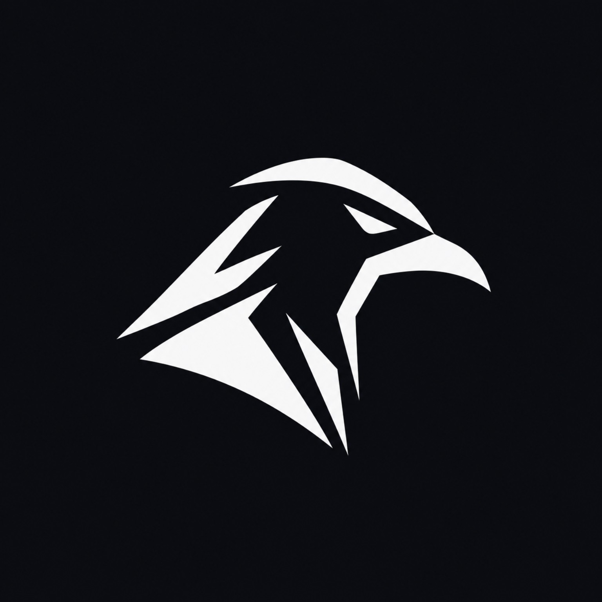

<p align="center">
  
</p>

<h1 align="center">Corvus</h1>

<p align="center">
  <strong>Lightweight, Native AOT Server Launcher & Monitoring Dashboard for Self-Hosted Nodes</strong>
</p>

<p align="center">
  
  
  
  
  
  
</p>

---

## 🌟 Overview

**Corvus** is an ultra-lightweight, self-hosted server launcher and observability dashboard designed for homelabs, VPS instances, and self-hosted environments. Compiled ahead-of-time (**Native AOT**) with zero dynamic reflection, it runs within a **<30 MB RAM footprint** while providing real-time container discovery, service health monitoring, time-series resource tracking, container live logs, multi-channel alerts, and periodic push monitoring.

---

## ✨ Key Features

- **🚀 Dual-Mode Service Launcher:**
  - **Automatic Discovery:** Detects Docker containers via direct Docker socket communication (`/var/run/docker.sock`), extracting Glance-style metadata (`corvus.name`, `corvus.category`, `corvus.url`, etc.).
  - **Manual Services:** Add external URLs, bare-metal endpoints, IoT devices, or local services.
  - **Visual Reordering:** Drag & drop / up-down service ordering with persistent `display_order`.
- **🪵 Real-Time Container Log Streaming:**
  - Zero-allocation multiplexed demuxer (`DockerLogDemuxer.cs`) for Docker stdout/stderr streams.
  - Real-time Server-Sent Events (`/api/containers/{id}/logs/stream`) with dark monospace terminal modal, keyword filtering, and auto-scroll.
- **⚡ Container Stats & Lifecycle Controls:**
  - Live per-container CPU %, Memory (usage/limit), and Net I/O (Rx/Tx) via Docker Stats API.
  - Lifecycle actions: **Start**, **Stop**, **Pause**, **Unpause**, and **Restart** with confirmation modals.
  - **Compose Stack Grouping:** Toggle between flat list and collapsible Docker Compose projects (`com.docker.compose.project`).
- **🔔 Multi-Channel Alerting Engine:**
  - Instant state transition alerts (Down 🔴 / Recovered 🟢) sent to **Discord**, **Telegram**, **Ntfy / Gotify**, and **Generic Webhooks**.
  - One-click test notification dispatcher in Settings.
- **⏱️ Extended Endpoint Uptime & SSL Tracking:**
  - **HTTP/HTTPS & TCP Port Ping:** Socket-level connection test for non-HTTP services (databases, SSH, game servers).
  - **SSL Certificate Expiration:** Auto-tracks SSL remaining days and issuer; triggers alert if expiration is within 14 days.
- **💀 Dead Man's Snitch (Periodic Push Monitor):**
  - Monitor cron jobs and backup scripts (`borg`, `restic`, scripts).
  - Configurable expected interval (e.g. every 24h) and grace period; automatically alerts when overdue.
- **🌐 Public Status Page:**
  - Unauthenticated, dark-themed `/status` route and `/api/status-page` API.
  - Displays overall system status banner, service uptime percentages, and SSL days.
- **🛡️ Zero-Trust SSO & Reverse Proxy Auth:**
  - Auto-login support via trusted headers: `Tailscale-User-Login`, `Cf-Access-Authenticated-User-Email`, `Remote-User`, `X-Forwarded-User`.
  - Built-in credentials authentication with configurable registration toggle.
- **📱 Responsive Mobile & Tablet First:**
  - Slide-over drawer navigation, sticky mobile header, and dual-mode responsive tables/cards.
- **⚡ Performance & Optimization:**
  - SQLite WAL mode with `PRAGMA busy_timeout = 5000;`, `PRAGMA temp_store = MEMORY;`.
  - Route code-splitting via `React.lazy` and Vite `manualChunks` (initial bundle <200 KB).

---

## 🏗️ Architecture

```
Corvus Architecture:
┌────────────────────────────────────────────────────────┐
│               Corvus Web Dashboard                    │
│   (React 19 + TypeScript + Tailwind v4 + Recharts)    │
│   [Routes: Dashboard, Services, Containers, Uptime,    │
│            Metrics, Settings, Public Status (/status)] │
└───────────────────────────┬────────────────────────────┘
                            │ REST API + SSE Stream (/api/stream/events)
┌───────────────────────────▼────────────────────────────┐
│               Corvus Core Engine                       │
│       ASP.NET Core Minimal API (.NET 9 Native AOT)     │
├───────────────────────────┬────────────────────────────┤
│  Docker REST API Client   │  SQLite + Dapper.AOT       │
│  (SocketsHttpHandler)     │  (DbUp Migrations 001-003) │
├───────────────────────────┴────────────────────────────┤
│  Core Services:                                        │
│  - DockerLogDemuxer (Zero-alloc multiplexed demuxer)   │
│  - NotificationService (Discord, Telegram, Ntfy, Web)  │
│  - EventBroadcaster (Channel<ServerEventDto> for SSE)  │
│  - AuthService (Zero-Trust SSO + Session Cookies)      │
├────────────────────────────────────────────────────────┤
│  Background Services:                                  │
│  - ContainerDiscoveryService (10s)                     │
│  - SystemMetricsCollector (15s)                        │
│  - UptimeCheckerService (TCP Ping, SSL, Snitch - 60s)  │
│  - RetentionCleanupService (24h)                       │
└────────────────────────────────────────────────────────┘
```

---

## 🚀 Quick Start with Docker Compose

Create a `docker-compose.yml` file:

```yaml
services:
  corvus:
    image: corvus:latest
    container_name: corvus
    restart: unless-stopped
    ports:
      - "8090:8090"
    environment:
      - CORVUS_PORT=8090
      - CORVUS_DATA_DIR=/data
      - DOCKER_SOCKET=/var/run/docker.sock
      - CORVUS_AUTH_ENABLED=true
      - CORVUS_AUTH_USER=admin
      - CORVUS_AUTH_PASS=corvus123
    volumes:
      - /var/run/docker.sock:/var/run/docker.sock:ro
      - corvus-data:/data

volumes:
  corvus-data:
```

Run the container:

```bash
docker compose up -d
```

Open your browser at **`http://localhost:8090`** (or public status page at **`http://localhost:8090/status`**).

---

## 🏷️ Docker Container Labels

Enhance your containers with Corvus metadata labels in your compose files:

```yaml
labels:
  - "corvus.name=Nextcloud Hub"
  - "corvus.category=Cloud Storage"
  - "corvus.description=Personal file sync and share"
  - "corvus.url=https://cloud.example.com"
  - "corvus.healthcheck=https://cloud.example.com/status.php"
  - "corvus.icon=cloud"
  - "corvus.ignore=false"
```

---

## 📡 API Endpoints Overview

| Method & Path | Description |
|---|---|
| `GET /api/dashboard/summary` | Consolidated KPI overview |
| `GET /api/services` | Service catalogue with ordering and SSL info |
| `PUT /api/services/reorder` | Update visual service ordering |
| `GET /api/status-page` | Public unauthenticated system status summary |
| `GET /api/containers` | Docker containers list with state and ports |
| `GET /api/containers/{id}/stats` | Live container CPU%, RAM, Net I/O |
| `GET /api/containers/{id}/logs` | Snapshot container logs |
| `GET /api/containers/{id}/logs/stream` | Real-time SSE container log stream |
| `POST /api/containers/{id}/start` | Start container |
| `POST /api/containers/{id}/stop` | Stop container |
| `POST /api/containers/{id}/pause` | Pause container |
| `POST /api/containers/{id}/unpause` | Unpause container |
| `POST /api/containers/{id}/restart` | Restart container |
| `GET /api/push-monitors` | List Dead Man's Snitch periodic push monitors |
| `POST /api/push-monitors` | Create new Dead Man's Snitch monitor |
| `POST /api/push/{token}` | Push webhook ping for backups and cron jobs |
| `POST /api/notifications/test` | Test alert dispatch (Discord, Telegram, Ntfy, Webhook) |
| `GET /api/stream/events` | Server-Sent Events live status stream |
| `GET /api/auth/status` | Current session & Zero-Trust SSO detection |

---

## 🛠️ Development & Building from Source

### Prerequisites
- [.NET 9.0 SDK](https://dotnet.microsoft.com/download/dotnet/9.0)
- [Node.js 20+](https://nodejs.org/)

### Building the Project
1. **Frontend:**
   ```bash
   cd src/Corvus.Web
   npm install
   npm run build
   ```
2. **Backend:**
   ```bash
   cd ../Corvus.Api
   dotnet run
   ```
3. **Running Tests:**
   ```bash
   dotnet test tests/Corvus.Api.Tests
   ```

---

## 📄 License

This project is licensed under the [MIT License](LICENSE).
