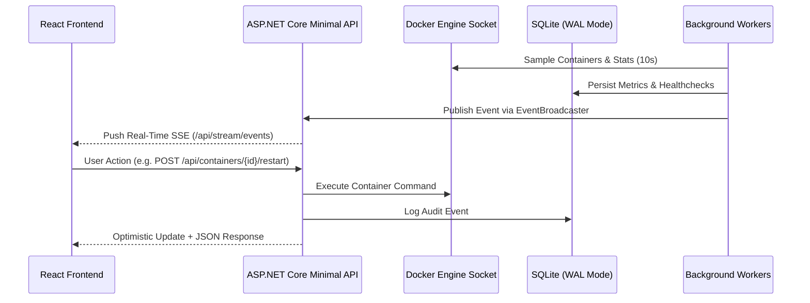

<div align="center">

[](architecture.md)
[](architecture.tr.md)

</div>

# Corvus — Repository and System Architecture

This document specifies the current file organization, layered architecture, background services, and data flow of Corvus.

---

## 📁 Directory Structure

```
corvus/
├── docker-compose.yml
├── Dockerfile                    # Multi-stage: Frontend build + .NET 9 AOT build + minimal runtime
├── README.md                     # Project overview and quick start (English)
├── README.tr.md                  # Project overview and quick start (Türkçe)
├── CONTRIBUTING.md               # Contribution and architecture guidelines (English)
├── CONTRIBUTING.tr.md            # Contribution and architecture guidelines (Türkçe)
├── LICENSE
│
├── src/
│   ├── Corvus.Api/                # Backend — ASP.NET Core Minimal API, .NET 9 Native AOT
│   │   ├── Program.cs             # Application entry point, DI, and Minimal API mapping (113 lines)
│   │   ├── Corvus.Api.csproj
│   │   ├── Endpoints/             # Resource-oriented Minimal API endpoints (extension methods)
│   │   │   ├── AuthEndpoints.cs          # Session auth, registration toggle, and Zero-Trust SSO
│   │   │   ├── BackupEndpoints.cs        # One-click SQLite VACUUM INTO snapshot download
│   │   │   ├── ContainersEndpoints.cs    # Containers, /stats, /logs, /logs/stream, and lifecycle controls
│   │   │   ├── DashboardEndpoints.cs     # Dashboard aggregated KPI summary
│   │   │   ├── MetricsEndpoints.cs       # Host system metrics time-series
│   │   │   ├── NotificationEndpoints.cs  # Multi-channel alert test endpoint
│   │   │   ├── PushEndpoints.cs          # Push webhooks and Dead Man's Snitch (/push-monitors)
│   │   │   ├── ServicesEndpoints.cs      # Service CRUD and /reorder
│   │   │   ├── SettingsEndpoints.cs      # Dynamic system settings and database size telemetry
│   │   │   ├── StatusPageEndpoints.cs    # Public unauthenticated status summary (/api/status-page)
│   │   │   ├── StreamEndpoints.cs        # Live Server-Sent Events stream (/api/stream/events)
│   │   │   └── UptimeEndpoints.cs        # Service uptime check history
│   │   ├── BackgroundServices/    # Continuous background worker threads
│   │   │   ├── ContainerDiscoveryService.cs  # Docker socket periodic container discovery (10s)
│   │   │   ├── SystemMetricsCollector.cs     # Host CPU/RAM/Disk/Net metrics sampler (15s)
│   │   │   ├── UptimeCheckerService.cs       # HTTP/TCP ping, SSL cert tracking, and Snitch checks (60s)
│   │   │   └── RetentionCleanupService.cs    # Dynamic retention data cleanup & PRAGMA optimize (24h)
│   │   ├── Data/                  # Persistence and data access layer (Dapper.AOT + SQLite)
│   │   │   ├── DbConnectionFactory.cs        # SQLite WAL, busy_timeout=5000, and PRAGMA tuning
│   │   │   ├── DatabaseMigrator.cs           # DbUp sequential migration runner
│   │   │   ├── ServicesRepository.cs         # Service definition and override queries
│   │   │   ├── PushMonitorRepository.cs      # Dead Man's Snitch data access
│   │   │   ├── UptimeRepository.cs           # Uptime history data access
│   │   │   ├── MetricsRepository.cs          # Host telemetry time-series storage
│   │   │   ├── BackupRepository.cs           # Push backup event logs
│   │   │   ├── UserRepository.cs             # User accounts and password hashing
│   │   │   ├── SettingsRepository.cs         # Key-value dynamic application settings
│   │   │   └── Migrations/                   # Ordered migration SQL scripts
│   │   │       ├── 001_init.sql
│   │   │       ├── 002_add_users.sql
│   │   │       ├── 003_roadmap_features.sql
│   │   │       └── 004_performance_indexes.sql
│   │   ├── Models/                 # DTOs and Database Entities
│   │   │   ├── Service.cs                    # Service entity (check_type, port, ssl, is_public, display_order)
│   │   │   ├── ServiceOverride.cs            # Docker label override model
│   │   │   ├── PushMonitor.cs                # Dead Man's Snitch entity
│   │   │   ├── DockerModels.cs               # Docker Engine API schemas
│   │   │   ├── DockerActionResult.cs         # Container action result response
│   │   │   ├── SystemMetric.cs               # System hardware metrics sample
│   │   │   ├── UptimeCheck.cs                # Health check audit log
│   │   │   ├── BackupEvent.cs                # External push backup ping
│   │   │   ├── User.cs                       # User authentication entity
│   │   │   ├── VersionInfo.cs                # Update checker DTO
│   │   │   └── CorvusJsonSerializerContext.cs # .NET 9 Native AOT JsonSourceGeneration context
│   │   └── Services/                # Core domain business logic
│   │       ├── DockerHttpClient.cs           # SocketsHttpHandler direct socket client
│   │       ├── DockerService.cs              # Container operations, stats, and label parsing
│   │       ├── DockerLogDemuxer.cs           # Zero-alloc multiplexed Docker stdout/stderr demuxer
│   │       ├── NotificationService.cs        # Bilingual multi-channel alert dispatcher (Discord, Telegram, Ntfy, Webhook)
│   │       ├── EventBroadcaster.cs           # Bounded Channel SSE real-time event publisher
│   │       ├── AuthService.cs                # Zero-Trust SSO proxy headers & SHA-256 session auth
│   │       ├── CorvusAuthFilter.cs           # Minimal API EndpointFilter authentication layer
│   │       └── UpdateCheckerService.cs       # GitHub Releases version checking
│   │
│   └── Corvus.Web/                 # Frontend — TypeScript + React 19 + Vite + Tailwind CSS v4
│       ├── vite.config.ts          # Optimized Vite build with manual vendor chunks
│       ├── src/
│       │   ├── main.tsx
│       │   ├── App.tsx             # React.lazy route code-splitting & SSE streaming listener
│       │   ├── types/              # Modular type contracts (Clean Architecture)
│       │   │   └── index.ts        # All API and DTO interface types
│       │   ├── api/                # Modular API client layer
│       │   │   ├── http.ts         # fetchJson, in-memory SWR cache (fetchCachedJson), invalidateCache
│       │   │   ├── auth.ts         # Authentication endpoints
│       │   │   ├── services.ts     # Service CRUD and reordering
│       │   │   ├── containers.ts   # Container operations, batch stats (/stats-summary), and logs
│       │   │   ├── uptime.ts       # Uptime checks and push monitors
│       │   │   ├── metrics.ts      # Hardware metrics
│       │   │   ├── settings.ts     # Settings and backup
│       │   │   ├── index.ts        # Unified API object
│       │   │   └── client.ts       # Backward compatibility re-export layer
│       │   ├── i18n/               # Compile-time type-safe multi-language system
│       │   │   ├── en.ts           # Primary English dictionary
│       │   │   ├── tr.ts           # Turkish translation dictionary
│       │   │   ├── types.ts        # DeepStringify and schema types
│       │   │   └── index.tsx       # I18nProvider and useI18n hook
│       │   ├── utils/              # Modular helper and utility functions
│       │   │   ├── url.ts          # Service URL formatter and sanitization
│       │   │   ├── format.ts       # Byte sizing (B, KB, MB, GB, TB) formatter
│       │   │   └── grouping.ts     # Docker Compose intelligent grouping logic
│       │   ├── components/         # Shared global UI components ONLY
│       │   │   ├── Sidebar.tsx               # Responsive desktop rail & mobile slide-over drawer
│       │   │   ├── StatusBadge.tsx           # Health indicator badge (healthy, degraded, down)
│       │   │   ├── LanguageSwitch.tsx        # Compact & full interface language switcher
│       │   │   └── RegistrationPromptModal.tsx # Global first-admin prompt modal
│       │   └── pages/              # Modular feature-driven page directories
│       │       ├── AuthPage/
│       │       │   └── index.tsx             # Sign in and initial registration view
│       │       ├── Containers/
│       │       │   ├── index.tsx             # Page orchestrator & state manager (<250 lines)
│       │       │   ├── ContainerList.tsx     # Responsive mobile cards and desktop table
│       │       │   ├── ComposeStackGroup.tsx # Collapsible Docker Compose stack accordions
│       │       │   ├── ContainerStatsBadges.tsx # Real-time CPU, RAM, Net I/O badges
│       │       │   ├── ContainerActionButtons.tsx # Lifecycle controls with loading states
│       │       │   └── ContainerLogsModal.tsx   # Live container log streaming terminal
│       │       ├── Dashboard/
│       │       │   ├── index.tsx             # Consolidated KPI summary & active services
│       │       │   ├── SystemPulseHero.tsx   # Live system pulse, network I/O & update checker
│       │       │   ├── SystemKpiStrip.tsx    # 2-column compact KPI strip & full-width Disk bar
│       │       │   ├── AttentionRequiredCard.tsx # Degraded services and SSL certificate warning card
│       │       │   └── ActiveContainersWidget.tsx # 2-column responsive active containers card
│       │       ├── PublicStatus/
│       │       │   └── index.tsx             # Unauthenticated status page (/status)
│       │       ├── Services/
│       │       │   ├── index.tsx             # Service launcher and drag & drop reordering
│       │       │   └── AddServiceModal.tsx   # Modal for creating manual services
│       │       ├── Settings/
│       │       │   ├── index.tsx             # Settings shell and tab switcher
│       │       │   ├── GeneralSettingsTab.tsx # General options, retention & DB telemetry
│       │       │   ├── NotificationSettingsTab.tsx # Multi-channel alert configuration
│       │       │   └── BackupSettingsTab.tsx # Dual-mode internal/external backup manager
│       │       ├── SystemMetrics/
│       │       │   ├── index.tsx             # Time-series telemetry shell & period filter
│       │       │   ├── SystemKpiCards.tsx    # Live hardware utilization metric cards
│       │       │   ├── CpuMetricsChart.tsx   # CPU load area chart
│       │       │   ├── RamMetricsChart.tsx   # Memory utilization area chart
│       │       │   └── DiskStorageCard.tsx   # Disk usage and partition distribution
│       │       └── Uptime/
│       │           ├── index.tsx             # Uptime shell and tab selector
│       │           ├── PingUptimeTab.tsx     # HTTP/TCP ping, latency, and SSL tracking
│       │           ├── PushMonitorsTab.tsx   # Dead Man's Snitch cron monitor list
│       │           ├── AddSnitchModal.tsx    # Modal for creating push monitors
│       │           └── UptimeBar.tsx         # Historical 90-day uptime status bar
│       └── wwwroot/                # Production compiled bundle output (hosted by Corvus.Api)
│
├── tests/
│   └── Corvus.Api.Tests/           # xUnit Test Suite (85 Passing Tests)
│       ├── AuthServiceTests.cs
│       ├── DockerServiceTests.cs     # Container operations, micro-cache, and batch stats tests
│       ├── DockerLogDemuxerTests.cs
│       ├── NotificationServiceTests.cs
│       ├── RoadmapFeaturesTests.cs
│       ├── UpdateCheckerTests.cs
│       └── DatabaseMigrationAndRepositoryTests.cs
│
└── docs/                           # Technical specifications and architectural guides
    ├── architecture.md             # System architecture (English)
    ├── architecture.tr.md          # System architecture (Türkçe)
    ├── specification.md            # Technical specification (English)
    ├── specification.tr.md         # Technical specification (Türkçe)
    ├── design-system.md            # Design system and UI tokens (English)
    └── design-system.tr.md         # Design system and UI tokens (Türkçe)
```

---

## 🏛️ Clean Architecture & Modularity Principles

Corvus strictly adheres to **Clean Architecture** and **Single Responsibility** principles to maintain an elegant, maintainable, and open-source contributor-friendly codebase:

### 1. No Monolithic Files (Anti-Blob Rule)
- No single file should exceed its core responsibility. Pages are decomposed into clear feature directories (`pages/<Feature>/index.tsx`), and auxiliary tabs, modals, and list items are extracted into self-contained sub-components.

### 2. Centralized API Service Layer
- UI components **never** perform raw `fetch()` calls or handle HTTP protocol details directly.
- All backend communication is encapsulated in modular files under `src/api/` (`http.ts`, `services.ts`, `containers.ts`, etc.) with strict TypeScript typing and built-in SWR in-memory caching.

### 3. Feature-Scoped Modals and Tabs
- Modals, dialogs, and tabs that belong to a single page are colocated within that page's feature folder (e.g. `pages/Services/AddServiceModal.tsx`, `pages/Uptime/AddSnitchModal.tsx`, `pages/Containers/ContainerLogsModal.tsx`).
- `src/components/` is strictly reserved for truly global, cross-page elements (`Sidebar`, `StatusBadge`, `LanguageSwitch`, `RegistrationPromptModal`).

### 4. Utility Isolation
- Formatting, mathematical transforms, and URL normalization are never buried inside UI render trees. They reside in `src/utils/` (`url.ts`, `format.ts`, `grouping.ts`) and are covered by clean function signatures.

### 5. Backend Vertical Slices
- Endpoints are grouped cleanly by domain in `Endpoints/` as extension methods (`app.MapContainersEndpoints()`, `app.MapServicesEndpoints()`).
- Data access is segregated into dedicated Dapper repositories in `Data/`.
- Background tasks run as decoupled, resilient `BackgroundService` workers.

---

## 🔄 Data Flow & Real-Time Updates



---

## 🧠 Memory Resilience and In-Memory Micro-Cache

Corvus implements a multi-tier optimization architecture to sustain system memory usage within **30–45 MB** without relying on an external cache server (such as Redis):

1. **Zero-Dependency Micro-Cache:**
   - Docker socket reads (`GetContainersAsync`) and Dashboard summaries (`GET /api/dashboard/summary`) are cached for 2.5 seconds.
   - Uptime 24-hour percentage aggregations (`Get24hUptimePercentagesAsync`) are micro-cached for 5 seconds.
   - Rapid navigation between views reduces Docker socket calls and SQLite allocations by more than 90%.
2. **Batch Stats Endpoint:**
   - Replaces N+1 parallel socket reads with a single consolidated stream via `GET /api/containers/stats-summary`, gathering resource stats for all running containers at once.
3. **.NET 9 Elastic Memory Tuning (`System.GC.ConserveMemory=5`):**
   - Configures the CLR to eagerly release idle virtual memory pages back to the Linux kernel (`madvise`) following traffic spikes.
   - `RetentionCleanupService` performs an optimized Gen1 GC collection (`GC.Collect(1, GCCollectionMode.Optimized)`) after pruning expired records.

---

## 🛡️ Uptime Kuma-Grade 3-State Health Engine

To prevent false alarms from transient network latency or brief blips, Corvus applies a 3-state finite state machine for service health verification:
- **`healthy`:** Service responds promptly and passes HTTP 2xx/3xx or TCP port checks.
- **`degraded`:** A first failure is detected; the monitor enters degraded status with a yellow warning indicator, suppressing alarm dispatches.
- **`down`:** After 3 consecutive failures, the service transitions to down (red) and immediately dispatches alerts across configured notification webhooks (Discord, Telegram, Ntfy, Webhook).
- **Loopback Gateway Resolution:** Corvus automatically resolves loopback targets (`localhost`, `127.0.0.1`) to the Docker bridge gateway (`host.docker.internal`) so checks run accurately from within containerized environments.
