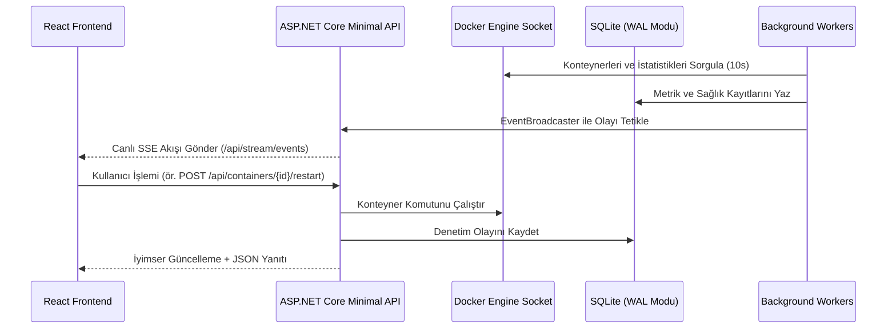

<div align="center">

[](architecture.md)
[](architecture.tr.md)

</div>

# Corvus — Klasör ve Sistem Mimarisi

Bu doküman, Corvus'un güncel dosya ve katman mimarisini, servislerini, temiz mimari standartlarını ve veri akışını belgeler.

---

## 📁 Dizin Yapısı

```
corvus/
├── docker-compose.yml
├── Dockerfile                    # Multi-stage: Frontend build + .NET 9 AOT build + minimal runtime
├── README.md                     # Proje genel bakışı ve hızlı başlangıç (İngilizce)
├── README.tr.md                  # Proje genel bakışı ve hızlı başlangıç (Türkçe)
├── CONTRIBUTING.md               # Katkı sağlama ve mimari kılavuzu (İngilizce)
├── CONTRIBUTING.tr.md            # Katkı sağlama ve mimari kılavuzu (Türkçe)
├── LICENSE
│
├── src/
│   ├── Corvus.Api/                # Backend — ASP.NET Core Minimal API, .NET 9 Native AOT
│   │   ├── Program.cs             # Uygulama girişi, DI ve Minimal API orkestrasyonu (113 satır)
│   │   ├── Corvus.Api.csproj      # Native AOT, Dapper.AOT, System.GC.ConserveMemory=5
│   │   ├── Endpoints/             # Kaynak odaklı Minimal API uç noktaları (extension metodlar)
│   │   │   ├── AuthEndpoints.cs          # Session auth, kayıt yönetimi ve Zero-Trust SSO
│   │   │   ├── BackupEndpoints.cs        # Tek tıkla SQLite VACUUM INTO anlık yedek indirme
│   │   │   ├── ContainersEndpoints.cs    # Containers, /stats, /stats-summary (toplu stats), /logs/stream ve kontroller
│   │   │   ├── DashboardEndpoints.cs     # 2.5s in-memory önbellekli Dashboard KPI özeti
│   │   │   ├── MetricsEndpoints.cs       # Sistem donanım metrikleri zaman serisi
│   │   │   ├── NotificationEndpoints.cs  # Çok kanallı alarm test uç noktası
│   │   │   ├── PushEndpoints.cs          # Push webhooks ve Dead Man's Snitch (/push-monitors)
│   │   │   ├── ServicesEndpoints.cs      # Servis CRUD ve /reorder
│   │   │   ├── SettingsEndpoints.cs      # Dinamik ayarlar, sürüm kontrolü (/version) ve DB disk telemetrisi
│   │   │   ├── StatusPageEndpoints.cs    # Şifresiz halka açık durum özeti (/api/status-page)
│   │   │   ├── StreamEndpoints.cs        # Canlı SSE olay akışı (/api/stream/events)
│   │   │   └── UptimeEndpoints.cs        # Servis uptime denetim geçmişi
│   │   ├── BackgroundServices/    # Arka plan çalışan iş parçacıkları
│   │   │   ├── ContainerDiscoveryService.cs  # Docker socket periyodik konteyner senkronizasyonu (10s)
│   │   │   ├── SystemMetricsCollector.cs     # Host CPU/RAM/Disk/Net metrik toplayıcısı (15s)
│   │   │   ├── UptimeCheckerService.cs       # Uptime Kuma 3 durumlu HTTP/TCP ping, SSL ve Snitch denetimi (60s)
│   │   │   └── RetentionCleanupService.cs    # Dinamik veri saklama temizleyicisi, PRAGMA optimize & GC compact (24h)
│   │   ├── Data/                  # Veri erişim katmanı (Dapper.AOT + SQLite)
│   │   │   ├── DbConnectionFactory.cs        # SQLite WAL, busy_timeout=5000 ve PRAGMA optimizasyonları
│   │   │   ├── DatabaseMigrator.cs           # DbUp sıralı göç yöneticisi
│   │   │   ├── ServicesRepository.cs         # Servis ve override sorguları
│   │   │   ├── PushMonitorRepository.cs      # Dead Man's Snitch veri erişimi
│   │   │   ├── UptimeRepository.cs           # Uptime geçmişi ve 5s önbellekli 24h yüzde agregasyonu
│   │   │   ├── MetricsRepository.cs          # Host metrikleri
│   │   │   ├── BackupRepository.cs           # Push backup logları
│   │   │   ├── UserRepository.cs             # Kullanıcı hesapları ve parola hashleme
│   │   │   ├── SettingsRepository.cs         # Key-value ayarlar
│   │   │   └── Migrations/                   # Sıralı göç SQL dosyaları
│   │   │       ├── 001_init.sql
│   │   │       ├── 002_add_users.sql
│   │   │       ├── 003_roadmap_features.sql
│   │   │       └── 004_performance_indexes.sql
│   │   ├── Models/                 # DTO'lar ve Veritabanı Varlıkları
│   │   │   ├── Service.cs                    # Servis modeli (check_type, port, ssl, is_public, display_order)
│   │   │   ├── ServiceOverride.cs            # Docker override modeli
│   │   │   ├── PushMonitor.cs                # Dead Man's Snitch modeli
│   │   │   ├── DockerModels.cs               # Docker API modelleri
│   │   │   ├── DockerActionResult.cs         # Konteyner işlem sonucu yanıtı
│   │   │   ├── SystemMetric.cs               # Host donanım metrik modeli
│   │   │   ├── UptimeCheck.cs                # Uptime denetim kayıt modeli
│   │   │   ├── BackupEvent.cs                # Backup push bildirim modeli
│   │   │   ├── User.cs                       # Kullanıcı modeli
│   │   │   ├── VersionInfo.cs                # Dinamik GitHub SemVer sürüm DTO'su
│   │   │   └── CorvusJsonSerializerContext.cs # .NET 9 Native AOT JsonSourceGeneration context
│   │   └── Services/                # Çekirdek iş mantığı servisleri
│   │       ├── DockerHttpClient.cs           # SocketsHttpHandler ile doğrudan Docker REST istemcisi
│   │       ├── DockerService.cs              # 2.5s önbellekli konteyner işlemleri, toplu stats özeti ve etiket eşleme
│   │       ├── DockerLogDemuxer.cs           # Multiplexed Docker stdout/stderr sıfır bellek tahsisli ayrıştırıcı
│   │       ├── NotificationService.cs        # SSRF korumalı, çift dilli Discord, Telegram, Ntfy ve Webhook motoru
│   │       ├── EventBroadcaster.cs           # Çok istemcili Channel Pub/Sub SSE olay yayıncısı
│   │       ├── AuthService.cs                # Zero-Trust SSO proxy headers & SHA-256 session auth
│   │       ├── CorvusAuthFilter.cs           # Minimal API EndpointFilter kimlik doğrulama katmanı
│   │       └── UpdateCheckerService.cs       # GitHub Releases API sürüm kontrol servisi
│   │
│   └── Corvus.Web/                 # Frontend — TypeScript + React 19 + Vite + Tailwind CSS v4
│       ├── vite.config.ts          # manualChunks ile optimize edilmiş Vite yapılandırması
│       ├── src/
│       │   ├── main.tsx
│       │   ├── App.tsx             # React.lazy rota kod ayrıştırma (code-splitting) & SSE bağlantısı
│       │   ├── types/              # Modüler tip sözleşmeleri (Clean Architecture)
│       │   │   └── index.ts        # Tüm API ve DTO arayüz tipleri
│       │   ├── api/                # Modülerleştirilmiş API istemci katmanı
│       │   │   ├── http.ts         # fetchJson, in-memory SWR önbellek (fetchCachedJson), invalidateCache
│       │   │   ├── auth.ts         # Kimlik doğrulama uç noktaları
│       │   │   ├── services.ts     # Servis CRUD ve sıralama
│       │   │   ├── containers.ts   # Konteyner işlemleri, toplu stats (/stats-summary) ve loglar
│       │   │   ├── uptime.ts       # Uptime kontrolleri ve push monitörleri
│       │   │   ├── metrics.ts      # Donanım metrikleri
│       │   │   ├── settings.ts     # Ayarlar ve yedekleme
│       │   │   ├── index.ts        # Birleşik API nesnesi
│       │   │   └── client.ts       # Geriye dönük uyumluluk re-export katmanı
│       │   ├── i18n/               # Derleme anında tip güvenli çoklu dil sistemi
│       │   │   ├── en.ts           # Birincil İngilizce sözlük
│       │   │   ├── tr.ts           # Türkçe çeviri sözlüğü
│       │   │   ├── types.ts        # DeepStringify ve sözlük tipleri
│       │   │   └── index.tsx       # I18nProvider ve useI18n hook'u
│       │   ├── utils/              # Modüler yardımcı fonksiyonlar
│       │   │   ├── url.ts          # Servis URL formatlama ve güvenli dönüştürme
│       │   │   ├── format.ts       # Bayt dönüştürme (B, KB, MB, GB, TB) yardımcı modülü
│       │   │   └── grouping.ts     # Docker Compose akıllı gruplama mantığı
│       │   ├── components/         # SADECE ortak/paylaşılan global UI bileşenleri
│       │   │   ├── Sidebar.tsx               # Masaüstü ray menü & mobil slide-over çekmece
│       │   │   ├── StatusBadge.tsx           # Sağlık durumu rozeti (healthy, degraded, down)
│       │   │   ├── LanguageSwitch.tsx        # Kompakt ve tam modlu arayüz dil değiştirici
│       │   │   └── RegistrationPromptModal.tsx # İlk yönetici kayıt yönlendirme modalı
│       │   └── pages/              # Modüler özellik bazlı sayfa klasörleri
│       │       ├── AuthPage/
│       │       │   └── index.tsx             # Giriş ve kayıt ekranı
│       │       ├── Containers/
│       │       │   ├── index.tsx             # Toplu stats ile çalışan sayfa yöneticisi (<250 satır)
│       │       │   ├── ContainerList.tsx     # Duyarlı mobil kartlar ve masaüstü tablo görünümü
│       │       │   ├── ComposeStackGroup.tsx # Docker Compose stack projeleri için akordiyon bileşeni
│       │       │   ├── ContainerStatsBadges.tsx # CPU, RAM ve Ağ canlı rozetleri
│       │       │   ├── ContainerActionButtons.tsx # Yaşam döngüsü butonları ve yükleniyor durumları
│       │       │   └── ContainerLogsModal.tsx   # Canlı konteyner log terminali modalı
│       │       ├── Dashboard/
│       │       │   ├── index.tsx             # Konsolide KPI özeti ve çalışan servisler
│       │       │   ├── SystemPulseHero.tsx   # Canlı durum nabzı, ağ I/O ve güncelleme kontrol kartı
│       │       │   ├── SystemKpiStrip.tsx    # 2 sütunlu kompakt KPI şeridi ve tam genişlikte Disk çubuğu
│       │       │   ├── AttentionRequiredCard.tsx # Kritik arızalar ve SSL uyarıları kartı
│       │       │   └── ActiveContainersWidget.tsx # 2 sütunlu duyarlı aktif konteynerler kartı
│       │       ├── PublicStatus/
│       │       │   └── index.tsx             # Şifresiz halka açık durum sayfası (/status)
│       │       ├── Services/
│       │       │   ├── index.tsx             # Servis launcher ve sürükle-bırak sıralama
│       │       │   └── AddServiceModal.tsx   # Manuel servis ekleme modalı
│       │       ├── Settings/
│       │       │   ├── index.tsx             # Ayarlar kabuğu ve sekme seçici
│       │       │   ├── GeneralSettingsTab.tsx # Genel ayarlar, retention ve DB boyutu telemetrisi
│       │       │   ├── NotificationSettingsTab.tsx # Çok kanallı alarm yapılandırması
│       │       │   └── BackupSettingsTab.tsx # Çift yönlü dahili/harici yedekleme yöneticisi
│       │       ├── SystemMetrics/
│       │       │   ├── index.tsx             # Zaman serisi telemetri kabuğu ve periyot filtresi
│       │       │   ├── SystemKpiCards.tsx    # Canlı donanım kullanım kartları
│       │       │   ├── CpuMetricsChart.tsx   # CPU yükü alan grafiği
│       │       │   ├── RamMetricsChart.tsx   # Bellek kullanımı alan grafiği
│       │       │   └── DiskStorageCard.tsx   # Disk depolama ve bölüm dağılımı
│       │       └── Uptime/
│       │           ├── index.tsx             # Uptime kabuğu ve sekme seçici
│       │           ├── PingUptimeTab.tsx     # HTTP/TCP ping, gecikme ve SSL takibi
│       │           ├── PushMonitorsTab.tsx   # Dead Man's Snitch cron izleme listesi
│       │           ├── AddSnitchModal.tsx    # Push monitor oluşturma modalı
│       │           └── UptimeBar.tsx         # Geçmiş 90 günlük uptime çubuğu
│       └── wwwroot/                # Üretime hazır derlenmiş arayüz paketi (Corvus.Api tarafından sunulur)
│
├── tests/
│   └── Corvus.Api.Tests/           # xUnit Test Paketi (85 Başarılı Test)
│       ├── AuthServiceTests.cs
│       ├── DockerServiceTests.cs     # Konteyner işlemleri, micro-cache ve batch stats testleri
│       ├── DockerLogDemuxerTests.cs
│       ├── NotificationServiceTests.cs
│       ├── RoadmapFeaturesTests.cs
│       ├── UpdateCheckerTests.cs
│       └── DatabaseMigrationAndRepositoryTests.cs
│
└── docs/                           # Teknik şartnameler ve mimari kılavuzlar
    ├── architecture.md             # Sistem mimarisi (İngilizce)
    ├── architecture.tr.md          # Sistem mimarisi (Türkçe)
    ├── specification.md            # Teknik şartname (İngilizce)
    ├── specification.tr.md         # Teknik şartname (Türkçe)
    ├── design-system.md            # Tasarım sistemi ve arayüz tokenları (İngilizce)
    └── design-system.tr.md         # Tasarım sistemi ve arayüz tokenları (Türkçe)
```

---

## 🏛️ Temiz Mimari ve Modülerlik İlkeleri

Corvus, kod tabanının açık kaynak dünyasında örnek gösterilecek seviyede şeffaf, sürdürülebilir ve katkı sağlamaya elverişli kalabilmesi için **Temiz Mimari** ve **Tek Sorumluluk** ilkelerini sıkı şekilde uygular:

### 1. Tek Dosyaya Kod Yığma Yasağı (Anti-Monolith Kuralı)
- Hiçbir dosya kendi temel sorumluluğu dışındaki kodlarla şişirilemez. Sayfalar modüler özellik klasörlerine (`pages/<Özellik>/index.tsx`) bölünür; sekmeler, formlar ve modallar bağımsız alt bileşen dosyalarına çıkarılır.

### 2. Merkezileştirilmiş API Servis Katmanı
- UI bileşenleri içinde **asla** ham `fetch()` çağrıları veya HTTP protokol detayları bulunmaz.
- Tüm backend iletişimi `src/api/client.ts` içinde tip korumalı olarak tanımlanır. Sayfalar doğrudan `api.getServices()`, `api.startContainer()` vb. çağrılar yapar.

### 3. Sayfaya Özgü Modallar ve Sekmeler
- Yalnızca tek bir sayfaya ait olan modallar, sekmeler ve diyaloglar doğrudan o sayfanın klasöründe yer alır (ör. `pages/Services/AddServiceModal.tsx`, `pages/Uptime/AddSnitchModal.tsx`, `pages/Containers/ContainerLogsModal.tsx`).
- `src/components/` dizini kesinlikle yalnızca tüm projede ortak kullanılan (`Sidebar`, `StatusBadge`, `LanguageSwitch`, `RegistrationPromptModal`) bileşenlere ayrılmıştır.

### 4. Yardımcı Fonksiyonların İzolasyonu
- URL dönüştürme, formatlama ve hesaplama mantıkları JSX render ağacının içine gömülmez. `src/utils/` (`url.ts`, `format.ts`) altında modülerleştirilerek dışa aktarılır.

### 5. Backend Dikey Dilimleri (Vertical Slices)
- Minimal API endpoint'leri `Endpoints/` altında domain bazında extension metodlar olarak gruplanır (`app.MapContainersEndpoints()`, `app.MapServicesEndpoints()`).
- Veri erişimi `Data/` altında Dapper repository'lerine bölünmüştür.
- Arka plan işleri birbirinden bağımsız `BackgroundService` sınıflarında yürütülür.

---

## 🔄 Veri Akışı ve Gerçek Zamanlı Güncellemeler



---

## 🧠 Bellek Dayanıklılığı ve In-Memory Micro-Cache

Corvus, harici bir önbellek sunucusu (Redis vb.) çalıştırmadan sistem belleğini **30–45 MB** bandında tutmak için çok katmanlı bir optimizasyon mimarisi uygular:

1. **Sıfır Dış Bağımlılıklı Micro-Cache:**
   - Docker soket okumaları (`GetContainersAsync`) ve Dashboard özetleri (`GET /api/dashboard/summary`) 2.5 saniyelik mikro önbelleğe alınır.
   - Uptime 24 saatlik yüzde agregasyonları (`Get24hUptimePercentagesAsync`) 5 saniye önbellekte tutulur.
   - Hızlı sayfa geçişlerinde Docker soketi ve SQLite üzerinde oluşan nesne tahsisatları (allocations) %90 oranında engellenir.
2. **Toplu İstatistikler (Batch Stats Endpoint):**
   - Konteyner başına N+1 paralel `/stats` isteği yerine `GET /api/containers/stats-summary` ile çalışan tüm konteynerlerin metrikleri tek bir HTTP akışında toplanır.
3. **.NET 9 Bellek Tasarruf Yapılandırması (`System.GC.ConserveMemory=5`):**
   - İstek dalgalanmaları bittiğinde boşta kalan sanal sayfaların Linux çekirdeğine (`madvise`) hızlıca iade edilmesi sağlanır.
   - `RetentionCleanupService` eski kayıtları sildikten sonra `GC.Collect(1, GCCollectionMode.Optimized)` ile bellek sıkıştırması yapar.

---

## 🛡️ Uptime Kuma Seviyesinde 3 Durumlu Sağlık Motoru

Servis sağlığı kontrollerinde geçici ağ dalgalanmalarının yanlış alarm (false-positive) üretmesini önlemek için 3 durumlu sonlu durum makinesi (finite state machine) kullanılır:
- **`healthy`:** Servis yanıt veriyor ve HTTP 2xx/3xx veya açık TCP portu doğrulandı.
- **`degraded`:** İlk başarısızlık tespit edildi; sistem alarm üretmez, servisi sarı uyarı moduna alır.
- **`down`:** 3 ardışık başarısızlık sonrasında servis kırmızıya döner ve yapılandırılmış bildirim kanallarına (Discord, Telegram, vb.) alarm fırlatılır.
- **Loopback Ağ Çözümlemesi:** Docker içinde çalışan Corvus'un host üzerindeki servislere (`localhost`, `127.0.0.1`) erişebilmesi için varsayılan bridge ağ geçidi (`host.docker.internal`) otomatik çözümlenir.
